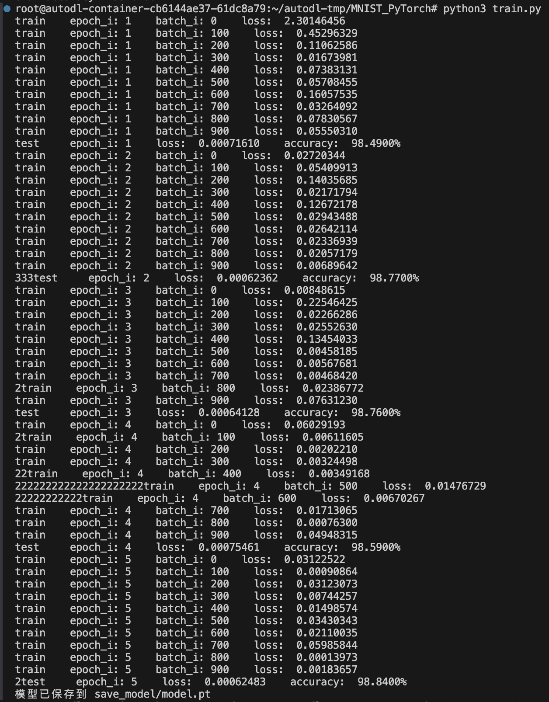
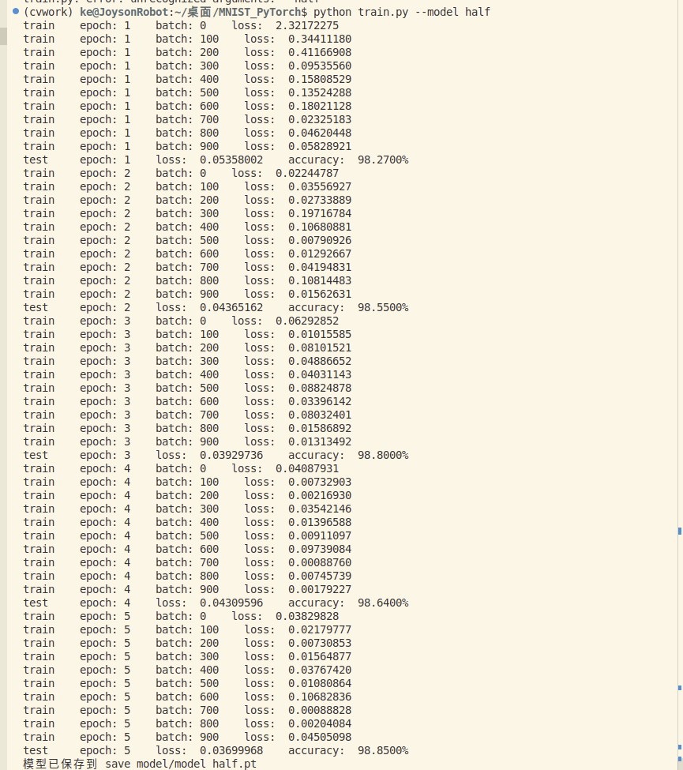
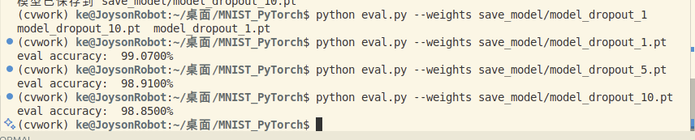

# MNIST 手写数字识别实验报告

作者环境：conda 环境 `cvwork`；深度学习框架：PyTorch + TorchVision
# MNIST 手写数字识别实验报告

作者环境：conda 环境 `cvwork`；深度学习框架：PyTorch + TorchVision

## 0. 实验准备
- 数据集：MNIST（训练 60,000 / 测试 10,000），由 `dataset.py` 自动下载与归一化。
- 预处理：`ToTensor()` + `Normalize([0.1307], [0.3081])`；批大小 64；训练集 shuffle=True。
- 训练脚本：`train.py`；评估脚本：`eval.py`；优化器默认使用 Adam，学习率 1e-3，训练 5 个 epoch。

---

## 1. 基线实验（文件：`cnn.py`）

### 1.1 目标
实现 LeNet-5 风格 CNN，作为后续实验的性能参考。

### 1.2 核心代码
```python
class CNN(nn.Module):
    def __init__(self):
        super(CNN, self).__init__()
        self.conv1 = nn.Conv2d(1, 10, kernel_size=5)
        self.conv2 = nn.Conv2d(10, 20, kernel_size=3)
        self.fc1 = nn.Linear(20 * 10 * 10, 500)
        self.fc2 = nn.Linear(500, 10)

    def forward(self, x):
        batch_size = x.size(0)
        x = F.relu(self.conv1(x))
        x = F.max_pool2d(x, kernel_size=2, stride=2)
        x = F.relu(self.conv2(x))
        x = x.view(batch_size, -1)
        x = F.relu(self.fc1(x))
        x = self.fc2(x)
        return F.log_softmax(x, dim=1)
```

### 1.3 运行命令
```bash
python train.py --model baseline --epochs 5 --lr 1e-3 --save-path save_model/model.pt
python eval.py --weights save_model/model.pt
```

### 1.4 实验结果
- 测试准确率约 98.8% ~ 98.9%。
- 训练/验证曲线：`result/model.png`



### 1.5 小结
基线网络在 MNIST 上快速收敛，作为后续改进的参考基线。

---

## 2. 半通道实验（文件：`cnn_half.py`）

### 2.1 目标
在保持网络结构深度不变的情况下，将每个卷积层的输出通道数减半，观察性能变化。

### 2.2 核心代码
```python
class CNNHalf(nn.Module):
    def __init__(self):
        super().__init__()
        self.conv1 = nn.Conv2d(1, 5, kernel_size=5)
        self.conv2 = nn.Conv2d(5, 10, kernel_size=3)
        self.fc1 = nn.Linear(10 * 10 * 10, 250)
        self.fc2 = nn.Linear(250, 10)
```

### 2.3 运行命令
```bash
python train.py --model half --epochs 5 --lr 1e-3 --save-path save_model/model_half.pt
python eval.py --weights save_model/model_half.pt
```

### 2.4 实验结果
- 参数量约为基线的 1/4，但测试准确率仍约 98.8% ~ 98.9%。
- 曲线：`result/half.png`



### 2.5 小结
MNIST 任务对模型容量要求较低，即使大幅压缩卷积通道也能保持高精度。

---

## 3. Dropout 实验（文件：`cnn_dropout.py`）

### 3.1 目标
在基线模型的卷积与全连接层之间插入 Dropout，测试丢弃率 1%、5%、10% 对泛化的影响。

### 3.2 核心代码
```python
class CNNDropout(nn.Module):
    def __init__(self, dropout_prob: float = 0.05):
        super().__init__()
        self.conv1 = nn.Conv2d(1, 10, kernel_size=5)
        self.conv2 = nn.Conv2d(10, 20, kernel_size=3)
        self.dropout2d = nn.Dropout2d(p=dropout_prob)
        self.fc1 = nn.Linear(20 * 10 * 10, 500)
        self.dropout = nn.Dropout(p=dropout_prob)
        self.fc2 = nn.Linear(500, 10)
```

### 3.3 运行命令
```bash
python train.py --model dropout --dropout 0.01 --epochs 5 --lr 1e-3 --save-path save_model/model_dropout_1.pt
python train.py --model dropout --dropout 0.05 --epochs 5 --lr 1e-3 --save-path save_model/model_dropout_5.pt
python train.py --model dropout --dropout 0.10 --epochs 5 --lr 1e-3 --save-path save_model/model_dropout_10.pt
python eval.py --weights save_model/model_dropout_10.pt
```

### 3.4 实验结果
- p = 0.01：约 99.0%
- p = 0.05：约 98.9%
- p = 0.10：约 98.8%
- 曲线：`result/dropout.png`



### 3.5 小结
轻度 Dropout（1%）提供微弱正则化，丢弃率过高时精度略降，符合容量受限的预期。

---

## 4. 汇总与结论
- MNIST 任务对模型容量要求不高，Half 模型在降低参数量的同时保持与基线几乎相同的精度。
- Dropout 在该配置下影响有限，建议结合更长训练或更复杂数据集进一步验证。

后续可尝试：
1. 在 CIFAR-10 等数据集上重复实验；
2. 结合学习率调度、权重衰减或数据增强；
3. 统计不同模型的参数数量、推理时间以及能耗等。

报告文件：`result/mnist_report.md`
